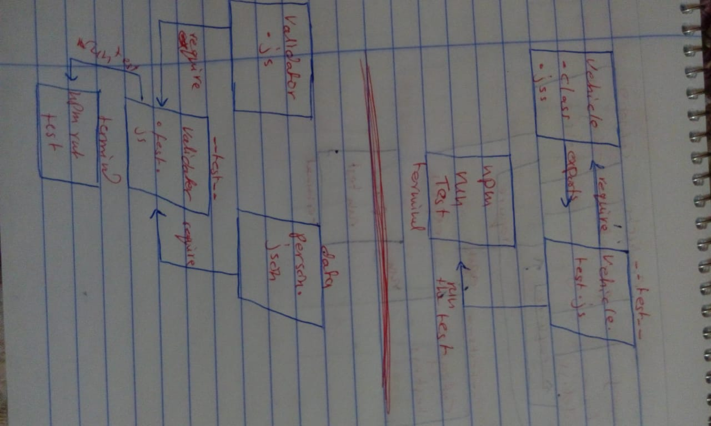

# LAB - Class 02

## Classes, Inheritance, Functional Progra

### Author: Saja Swalgah

### Links and Resources
submission PR :  https://github.com/Saja-401-advanced-javascript/class-02/pull/1

ci/cd (GitHub Actions) : https://github.com/Saja-401-advanced-javascript/class-02/actions/runs/31404634

#### How to initialize/run your application (where applicable)
npm init -y 
npm install jest eslint
npm run test

## Tests
How do you run tests?
npm run test

UML

